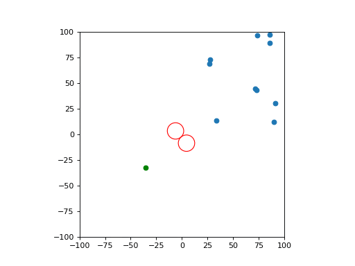
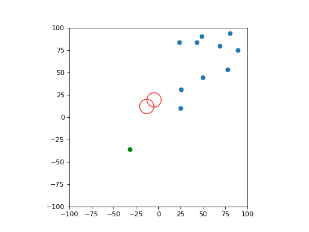
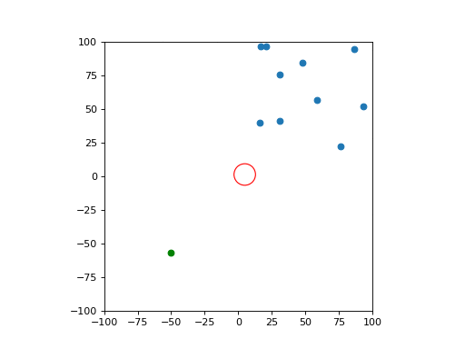

# Swarms
Models of artificial swarms.

## Data generation

```bash
python obstacle_avoidance_sim.py --boids B --vicseks V --obstacles OBST --steps N_STEPS --save-dir /path/to/save/location/
```
B: No. of Boids  
V: No. of Vicseks  
OBST: No. of obstacles  
N_STEPS: No. of steps for which data is generated  

### Files Generated
*_edge.npy: Edge type data   
*_time.npy: Time steps(dt)  
*_timeseries.npy: N_STEPS x N x D tensor  

N: Goal + No. of obstacles + No. of Boids + No. of Vicseks  
D: State vector in form of (position, velocity)

## Edge types
Edge types of the directed graph represent the influences between
elements of the system.
```
|    |Goal|Obst|Boid|Visc|  
|Goal| 0  | 0  | 1  | 5  |  
|Obst| 0  | 0  | 2  | 6  |  
|Boid| 0  | 0  | 3  | 7  |  
|Visc| 0  | 0  | 4  | 8  |  
```

## Boid

A simple implementation of Craig Reynolds' [Boids](https://www.red3d.com/cwr/boids/) model.  




## Vicsek

An implementation of [Helbing - Farkas - Vicsek](https://www.nature.com/articles/35035023) model. 

